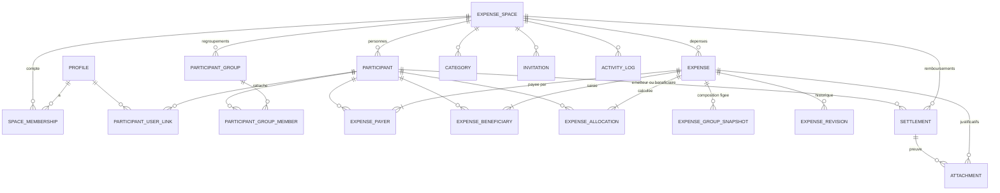

# Mister Settle — analyse initiale (étapes 1 à 3, première passe)

> Première réponse à la mission du 07/09/2026 : **aucune ligne de l'application
> n'est écrite ici**. Ce document pose ce qui a été observé dans le socle, ce
> qui est décidé, ce qui est supposé — et distingue les trois, en toutes
> lettres.
>
> Légende : **[FAIT]** observé dans le code des dépôts ; **[DÉCISION]** choix
> proposé ; **[HYPOTHÈSE]** supposition à confirmer ; **[INCONNU]** non
> vérifiable depuis ici.

## 1. Résumé de compréhension

Mister Settle est une PWA collaborative de la famille `miss-*` / `mister-*`
qui répartit des dépenses entre particuliers — voyage, colocation, événement,
famille, projet entre amis. Elle **calcule** : qui a payé, qui doit combien, et
quels remboursements permettraient de solder. Elle **ne fait pas** : pas de
carte, pas de transfert, pas de connexion bancaire, pas de demande de paiement,
pas de coordonnées bancaires, pas d'encaissement. Les remboursements réels ont
lieu dehors ; l'application permet seulement de **déclarer** qu'ils ont eu lieu.

Trois idées structurent le modèle :

1. **La personne physique est l'unité comptable.** Un « participant » est une
   personne d'un espace, avec ou sans compte. Un compte peut lui être rattaché
   plus tard sans perte d'historique.
2. **Les regroupements ne comptent pas.** « Famille Martin » sélectionne Alice,
   Bob et Charlie d'un geste, consolide leurs soldes à l'affichage, filtre —
   mais aucun montant ne vit jamais au niveau du regroupement, et sa
   composition est figée sur chaque dépense qui l'a utilisé.
3. **Une répartition se valide explicitement.** Trois modèles (équitable, par
   montant, par parts), un écran de synthèse, une action « Valider cette
   répartition », et toute modification calculatoire invalide la validation.
   Un brouillon n'entre jamais dans les soldes.

Le socle imposé est `@mister-guiiug/dev-pwa-config` (4.7.0 le 07/09/2026),
avec son squelette `pwa-starter-kit` et son générateur `create-lg-pwa-app`.
Backend Supabase (Postgres, Auth, RLS, Storage), déploiement GitHub Pages.

## 2. Hypothèses explicites

| #   | Hypothèse                                                                                                                                                                                                                     | Statut                                          |
| --- | ----------------------------------------------------------------------------------------------------------------------------------------------------------------------------------------------------------------------------- | ----------------------------------------------- |
| H1  | Le dépôt est `mister-guiiug/mister-settle`, public, servi sur `https://mister-guiiug.github.io/mister-settle/`, port de développement **5209** (prochain libre du catalogue).                                                 | Engendré par `create-lg-pwa-app` le 07/09/2026. |
| H2  | Un projet Supabase **dédié** sera créé pour l'application (offre Free, `eu-west-3` comme le reste du parc). Il n'existe pas encore.                                                                                           | [INCONNU] — question bloquante Q1.              |
| H3  | Le développement démarre sur le **repli local** du squelette (aucune configuration requise), Supabase venant port par port — c'est l'ADR 0004 du squelette.                                                                   | [DÉCISION]                                      |
| H4  | Authentification par e-mail + mot de passe **et** lien à usage unique (`LoginForm mode="otp"`), MFA TOTP différée, pas de connexion anonyme.                                                                                  | [DÉCISION]                                      |
| H5  | Une devise **principale par espace** ; au MVP, toute dépense est dans cette devise. Le modèle prévoit `currency` et `fx_rate` par dépense pour la V2 (taux saisi à la main, jamais d'API de change).                          | [DÉCISION]                                      |
| H6  | Précision monétaire : les **unités mineures ISO 4217** (2 décimales pour EUR/USD, 0 pour JPY, 3 pour KWD), calculées en entiers. Parts en `numeric(10,4)`.                                                                    | [DÉCISION]                                      |
| H7  | Quatre rôles par espace : `owner` (unique), `admin`, `contributor`, `reader`. Un compte ne peut être rattaché qu'à **une** personne par espace.                                                                               | [DÉCISION]                                      |
| H8  | Langues FR/EN dès le départ (convention du parc), FR par défaut ; le mot « regroupement » est une clé de traduction, renommable sans toucher au modèle.                                                                       | [DÉCISION]                                      |
| H9  | Hors ligne au MVP : **lecture** des espaces déjà ouverts (cache IndexedDB), **brouillons** de dépense locaux, et **création** de dépense mise en file (idempotente par UUID). Les autres écritures hors ligne sont différées. | [DÉCISION]                                      |
| H10 | Les justificatifs sont des images (JPEG/PNG/WebP), compressées côté client sans métadonnées EXIF, dans un bucket privé, consultées par URL signée courte. Le PDF est différé.                                                 | [DÉCISION]                                      |
| H11 | Suppression de compte = **anonymisation** : la personne reste dans ses espaces (ses dépenses appartiennent aux autres membres), son lien au compte et son profil disparaissent. C'est la règle de l'ADR 0009 du squelette.    | [DÉCISION]                                      |
| H12 | La récurrence des dépenses est **différée** : le socle n'a rien pour planifier, et un `pg_cron` est une pièce d'infrastructure qui mérite sa propre décision.                                                                 | [DÉCISION]                                      |
| H13 | Le poste de développement n'a pas la CLI Supabase et le démon Docker de WSL n'a pas été vérifié : les tests pgTAP se jouent d'abord **en CI** (pile jetable du réutilisable), puis contre la base liée par `pwa-pgtap`.       | [FAIT] CLI absente ; [INCONNU] démon Docker.    |

## 3. Analyse de `dev-pwa-config`, fondée sur son contenu réel

Tout ce qui suit a été lu dans `C:\Src\GithubMister\dev-pwa-config` (4.7.0,
`main` à jour), `pwa-starter-kit`, `create-lg-pwa-app`, et deux applications
de référence (`mister-miss-koh`, `miss-carbook`).

### 3.1 Ce qu'est le socle [FAIT]

- Un paquet npm sur GitHub Packages, **150 sous-chemins exportés**, **6 bins**
  (`pwa-icons`, `pwa-bundle-budget`, `pwa-doctor`, `pwa-pgtap`,
  `pwa-screenshots`, `pwa-bindings`), **zéro dépendance** — tout est en
  `peerDependencies` (React, Zod 4, Supabase JS, Tailwind 4, Vite 8, Vitest 4,
  Playwright, lucide-react, sharp…).
- Stack cible documentée : Node ≥ 22, TypeScript ~6.0.3 **strict** +
  `verbatimModuleSyntax` + `noUncheckedIndexedAccess`, ESLint 9 flat, Vite 8
  (Rolldown), Vitest 4, Zod 4, Prettier 3.6, Tailwind 4, `lucide-react`.
- Des workflows réutilisables `@v4` : `pwa-ci.yml` (Format · Lint · Type ·
  Test · Build, « Lockfile in sync », E2E `@critical|@a11y`, `run-doctor`),
  `pwa-deploy.yml` (`build-env` / `required-env`), `pwa-lighthouse.yml`,
  `pwa-supabase-test.yml` (pgTAP sur une pile jetable, **sans secret**),
  `pwa-supabase-migrate.yml`, `pwa-supabase-keepalive.yml`, `cleanup-runs.yml`.
- Un squelette vivant, `pwa-starter-kit`, et un générateur sans gabarit,
  `create-lg-pwa-app`, qui le tire à sa dernière étiquette (ou la pointe de
  `main` s'il n'en a aucune — c'est le cas le 07/09/2026).

### 3.2 Ce qui est réutilisé tel quel [FAIT → DÉCISION d'usage]

| Domaine              | Module du socle (vérifié)                                                                                                                                                                                                                                                                                                                                                                                                                                                                                                       | Usage dans Mister Settle                                                                                                             |
| -------------------- | ------------------------------------------------------------------------------------------------------------------------------------------------------------------------------------------------------------------------------------------------------------------------------------------------------------------------------------------------------------------------------------------------------------------------------------------------------------------------------------------------------------------------------- | ------------------------------------------------------------------------------------------------------------------------------------ |
| Authentification     | `react/auth-provider` (`signIn`, `signUp`, `signInWithOtp`, `signOut`), `react/auth-gate`, `react/login-form` (`signin`/`signup`/`otp`), `auth/supabase`, `auth/errors-fr`, `auth/mfa` (TOTP)                                                                                                                                                                                                                                                                                                                                   | Pile complète. MFA en V2.                                                                                                            |
| Client Supabase      | `supabase-client` — fabrique **paresseuse**, un seul client, `flowType: 'pkce'`, `SUPABASE_ENV_KEYS`, corrélation des requêtes                                                                                                                                                                                                                                                                                                                                                                                                  | Le client de l'app, jamais un second.                                                                                                |
| Sélection de backend | `backend` — `createBackendSelector` (repli local + backends déclarés par variables requises, objet **partiel** par port), `composeBackend`, `classifyBackendError`                                                                                                                                                                                                                                                                                                                                                              | Un port par agrégat (espaces, personnes, dépenses…), migré port par port.                                                            |
| Écritures hors ligne | `sync-queue` — file **persistante** (`createStore`), drain sérialisé, retrait exponentiel, **lettres mortes** consultables/rejouables, `keyOf` qui fusionne les écritures d'une même entité (upsert idempotent), plafond                                                                                                                                                                                                                                                                                                        | File de création/édition de dépenses. Le squelette montre l'enveloppe (`queued-notes.ts`, ADR 0010).                                 |
| Persistance locale   | `storage` (`createStore` préfixé), `versioned-store` (instantané `{v, data}`, migrations, validation Zod, copie de côté), `idb` (`createIdb` : `kv` + **blobs**), `backup`                                                                                                                                                                                                                                                                                                                                                      | Cache de lecture (IDB), brouillons (magasin versionné), photos en attente d'envoi (blobs IDB).                                       |
| Identifiants         | `id` — `createUuid()` (v4, « un identifiant local identique à la clé primaire rend l'insertion idempotente »), `createId()`                                                                                                                                                                                                                                                                                                                                                                                                     | Toute entité naît avec son UUID côté client : pas de double création au rejeu.                                                       |
| Formatage            | `format` — `formatCurrency`, `formatSigned` (moins typographique, zéro en mot), `formatDate`, `formatRelativeTime`, `formatList`… ; `react/i18n` — `fmt.currency(value, code)` lié à la locale                                                                                                                                                                                                                                                                                                                                  | Affichage des montants et soldes. **Formatage seulement** (cf. 3.4).                                                                 |
| Dates                | `dates` — `toIsoDate` / `fromIsoDate` en fuseau **local**, `startOfDay`, `addDays`                                                                                                                                                                                                                                                                                                                                                                                                                                              | La date d'une dépense est un jour civil (`date`), pas un instant.                                                                    |
| Saisies et sécurité  | `security` — `sanitizeSingleLine`, `sanitizeUserText`, `isValidEmail`, `maskEmail`, `generateSecureId` (128 bits), `hashString` (SHA-256), `redact`, `isSafeHttpUrl` ; `rate-limit` (confort client)                                                                                                                                                                                                                                                                                                                            | Libellés, notes, e-mails ; jeton d'invitation engendré côté client, **seul son hash** est stocké.                                    |
| Invitations, partage | `pairing` (codes courts sans confusion, liens profonds), `qr` (`qrToDataUrl`/`qrToSvg`), `share` (`shareOrCopy`, `currentAppUrl`), `react/share-button`                                                                                                                                                                                                                                                                                                                                                                         | Lien d'invitation + QR + partage natif avec repli presse-papiers.                                                                    |
| Justificatifs        | `image` — `validateImageFile`, `compressImageToMaxBytes`, `stripImageMetadata` (EXIF/GPS retirés **par construction**)                                                                                                                                                                                                                                                                                                                                                                                                          | Pipeline photo avant envoi.                                                                                                          |
| Exports              | `csv` (dialecte `excel-fr`, BOM, virgule décimale), `xlsx` (`buildXlsx`/`downloadXlsx`, déterministe), `download` (`dateSlug`, `downloadText`/`downloadBlob`), `pdf` (constructeur minimal)                                                                                                                                                                                                                                                                                                                                     | Dépenses et soldes en CSV et XLSX. PDF différé.                                                                                      |
| Temps réel           | `realtime` (`createChannel` : reconnexion, rattrapage, sonde au réveil) + `realtime/supabase`                                                                                                                                                                                                                                                                                                                                                                                                                                   | Mise à jour collaborative des dépenses (V1.1), avec la réserve documentée sur `catchUp` (cf. 3.4).                                   |
| Interface            | `AppHeader`, `PageContainer` (`reserve="bottom-nav"`), `BottomNav` (`maxVisible` + « plus »), `Button`, `Card`/`CardHeader`, `Badge`, `EmptyState`, `ErrorBanner`, `Skeleton`, `Sheet` (pied épinglé), `ConfirmDialog`, `Toast` (action **Annuler**), `SegmentedControl`, `TextField`/`SelectField`/`TextAreaField`, `Stat`, `Sparkline`/`BarChart`/`Gauge`, `PwaInstallPrompt`, `UpdatePromptBanner`, `ConnectionBanner`, `SyncStatusBadge`, `FamilyApps`, `AppFooter` (`issues`), `ThemeToggle`, `SkipLink`, `VisuallyHidden` | Tout le cadre et les primitives. Habillage par `components.css` (le piège documenté : sans elle, tout compile et rien ne s'affiche). |
| Hooks                | `useAsync`, `useActionGuard({ online })`, `useUndoableState`, `useKeyboardShortcuts`, `useMediaQuery`, `useFocusTrap`/`useEscape`/`useScrollLock`, `useLongPress`, `usePullToRefresh`, `useOnline`, `useLocalStorage`, `useRouteBreadcrumbs`, `usePageViews`                                                                                                                                                                                                                                                                    | Gardes d'action hors ligne, annulation, clavier, tirer-pour-rafraîchir.                                                              |
| Observabilité        | `react/observability` (`installErrorReporter`, `initSentry` inerte sans DSN, `ObservabilityBoundary`), `logger`, `correlation`                                                                                                                                                                                                                                                                                                                                                                                                  | Tel que câblé par le squelette (ADR 0006).                                                                                           |
| Build et PWA         | `vite-pwa` (`pwaBaseOptions({ id })` : manifeste complet, captures lues dans `public/screenshots/`), `vite-pwa-base` (`pwaSeoPlugin`, `spaFallbackPlugin`), `vite-csp`, `vite-version`, `apps-catalog` (`devPortOf`)                                                                                                                                                                                                                                                                                                            | Le `vite.config.ts` du squelette, inchangé hormis la CSP (hôtes Supabase).                                                           |
| i18n                 | `react/i18n` — `createI18n` (clés typées, `plural`, formateurs liés), `react/labels` (libellés des composants en sept langues)                                                                                                                                                                                                                                                                                                                                                                                                  | FR/EN, `storageKey` par défaut partagé par la famille.                                                                               |

### 3.3 Le squelette `pwa-starter-kit` [FAIT]

Ce que le générateur apporte, et que l'application **ne réécrira pas** :

- **La composition** : `main.tsx` (pile de fournisseurs dans un ordre
  justifié : `installErrorReporter` → `initSentry` → `VersionProvider` →
  `ThemeProvider paint={false}` → `I18nProvider` → `AuthProvider` →
  `ToastProvider`) et `App.tsx` (`ObservabilityBoundary` → `AppUpdates`
  `registerType: 'prompt'` → `BrowserRouter basename` → `AppHeader` +
  `ConnectionBanner` + `PageContainer` + `BottomNav placement="fixed"`).
- **Le backend hexagonal** : `src/backend/ports.ts` (schémas Zod dont les
  types sont dérivés, ports **asynchrones** et en **mutations**, pas en
  instantané), `local.ts`, `supabase.ts` (« la RLS fait le filtrage, pas ce
  code »), `queued-notes.ts` (la file du socle posée **sur le port**, pas dans
  l'adaptateur), `index.ts` (sélecteur + `coverage` affichée aux réglages).
- **L'état** : Zustand pour l'état vivant, écriture optimiste avec reprise
  (ADR 0002), « annuler plutôt que confirmer » avec sursis de 8 s (ADR 0008).
- **La configuration** : `src/app/config/env.ts` validé par Zod, **tout
  optionnel** ; `config/env.manifest.json` d'où dérivent `.env.example` et le
  `required-env` du déploiement.
- **La base** : migrations `0001` (profils, `touch_updated_at`,
  `handle_new_user`, `user_roles`/`has_role`/`is_admin`), `0002` (notes),
  `0003` (RLS : **double verrou** `revoke`/`grant` + politiques ; `anon` ne
  lit rien ; `user_id` vérifié par `with check`), `0004` (rôle dans le jeton
  par le hook « Custom Access Token »), `0005` (`delete_my_account`,
  `security definer`) ; tests pgTAP (`set local role authenticated` +
  `request.jwt.claims`) ; `supabase-tests.yml` sur pile jetable.
- **Dix ADR** (routeur par chemin ; Zustand + magasin versionné ; i18n ;
  port + repli local ; `prompt` jamais `autoUpdate` ; observabilité ; « la
  base décide, l'interface obéit » ; annuler plutôt que confirmer ; effacer
  son compte ; écrire hors ligne).
- **Les règles d'`AGENTS.md`** : chaque pièce justifiée par une mesure ; une
  décision = un ADR ; `npm run build` = budget de poids + `pwa-doctor --strict`
  à **zéro défaut, zéro dette, zéro info** ; PR obligatoire.

### 3.4 Ce que le socle n'a pas — les manques à signaler avant d'étendre [FAIT]

| Manque                                                                                                                                                                              | Réponse proposée [DÉCISION]                                                                                                                                                                                                                                     |
| ----------------------------------------------------------------------------------------------------------------------------------------------------------------------------------- | --------------------------------------------------------------------------------------------------------------------------------------------------------------------------------------------------------------------------------------------------------------- |
| **Aucune arithmétique monétaire.** `format.js` formate un `number` ; les seules occurrences de « centimes / décimal / devise » du paquet sont dans le formatage et le dialecte CSV. | Module local `src/domain/money.ts` : montants en **entiers d'unités mineures**, `BigInt` pour les produits (parts), fonctions pures, tests de propriété. Même algorithme en SQL pour la validation serveur.                                                     |
| **Aucun modèle de rôles.** Le README l'écrit : « Pas de rôles. Le port s'arrête à “qui est connecté” ». Le squelette lit un rôle **global** dans le jeton (`useRole`).              | Rôles **par espace** en base : `space_memberships` + fonctions `security definer` (`space_role`, `is_space_member`, `can_contribute`, `is_space_admin`) sur le modèle éprouvé de `miss-carbook`. Côté client, `useSpaceRole()` n'est qu'un confort d'affichage. |
| Composants de saisie absents : montant, sélection multiple à jetons, avatar/initiales, liste triable, date.                                                                         | Composants locaux dans `src/components/`, sur les jetons `--dwc-*` et les primitives existantes ; `<input type="date">` natif ; montant via `inputMode="decimal"` et un analyseur tolérant à la virgule.                                                        |
| Aucun helper **Supabase Storage** (`./storage` est le `localStorage` préfixé ; `push/supabase` est la notification).                                                                | Adaptateur mince sur le SDK : envoi dans un bucket privé, URL signée courte. Politiques `storage.objects` par préfixe `<space_id>/`.                                                                                                                            |
| **Aucune résolution de conflit.** La file fusionne côté client (dernière écriture) ; rien ne compare une version serveur.                                                           | Colonne `version` sur les agrégats, RPC qui **refuse** une écriture périmée ; le refus devient une lettre morte que l'écran explique (« modifiée par X entre-temps »), sans fusion automatique.                                                                 |
| `catchUp` du temps réel **n'applique pas `filter`** : dans une app multi-espaces, le rattrapage mélange les espaces (documenté dans le README).                                     | Ne câbler que `connect` et recharger la requête filtrée de l'écran à chaque retour `live`, comme le README le conseille.                                                                                                                                        |
| Ni récurrence ni planification.                                                                                                                                                     | Différé (H12).                                                                                                                                                                                                                                                  |
| Ni multi-devise ni taux (le formatage accepte un code, c'est tout).                                                                                                                 | Modèle prêt (`currency`, `fx_rate` figé), interface différée (H5).                                                                                                                                                                                              |

### 3.5 Précédents dans le parc [FAIT]

- **`miss-carbook`** a des `workspaces` + `workspace_members` avec
  `workspace_role()`, `is_workspace_member()`, `can_write_workspace()`,
  `is_workspace_admin()` — et **deux correctifs instructifs** : la politique
  d'insertion du premier membre (l'œuf et la poule : être admin avant
  d'exister), puis un RPC `create_workspace` en `security definer`. Mister
  Settle part directement du RPC atomique.
- **`mister-miss-koh`** joue 1 134 lignes de pgTAP : en CI sur pile jetable
  et contre la base liée (`pgtap-remote.mjs`, promu en `pwa-pgtap`).
- **`mister-doc`** anonymise à la suppression de compte parce que ses données
  survivent à leur auteur — exactement la situation d'une dépense partagée.

### 3.6 Conventions relevées, qui s'imposent [FAIT]

- Commits conventionnels, sujet en **français à l'impératif**, corps qui dit
  **pourquoi**. Une PR par lot, CI verte, ADR si une décision change.
- `data-dwc` + `components.css` pour toute primitive ; `lucide-react` pour
  les icônes fonctionnelles (`aria-hidden`, libellé sur le parent).
- **Règle famille des trois liens** (source, café, signalement) sur
  l'accueil **et** sur À propos / Réglages, **et nulle part ailleurs** ;
  `pwa-doctor --strict` la contrôle (`liens-famille`).
- `VITE_*` en **variables** de dépôt, jamais en secrets ; secrets **nommés**,
  jamais `secrets: inherit` ; `required-env` pour ce dont l'absence casse.
- Les tables naissent en `enable row level security` **sans politique** ;
  `anon` ne reçoit rien ; double verrou ; `security definer` toujours avec
  `set search_path = public`.
- Le lockfile s'écrit avec **npm 10** (celui du runner) : sur ce poste, cela
  veut dire **sous WSL** (Windows a npm 11).

### 3.7 Outillage du poste, vérifié le 07/09/2026 [FAIT]

- WSL : `gh` 2.92 authentifié avec helper d'identifiants git, nvm avec Node
  22/24/26 (Node 20 par défaut en shell de connexion), Docker 29.4.1 installé
  (**démon non vérifié**), CLI `supabase` **absente**. Le `fetch` de Node
  exige `NODE_EXTRA_CA_CERTS=/etc/ssl/certs/ca-certificates.crt` derrière le
  proxy d'entreprise (autorités `FETL_Root_CA` et `Zscaler_Root_CA` dans le
  magasin système, que Node n'utilise pas seul). Identité git globale de WSL :
  `guillaume.guerin@fromearthtolife.net` — **interdite** dans ce répertoire ;
  le générateur a été lancé avec `GIT_AUTHOR_*` / `GIT_COMMITTER_*` forcés sur
  `GuiiuG`.
- Windows : node 25 / npm 11 (lockfile incompatible avec la CI), CLI
  `supabase` absente.

## 4. Périmètre MVP proposé [DÉCISION]

**Dans le MVP**

- Comptes : inscription, connexion (mot de passe, lien), profil, suppression
  (anonymisation).
- Espaces : créer, consulter, modifier, archiver, supprimer (propriétaire) ;
  nom, description, devise, icône/couleur ; rôles ; activité récente.
- Personnes : liste, création sans compte, archivage, rattachement à un compte
  par invitation.
- Regroupements : créer, renommer, membres, archiver/supprimer ; sélection
  dans une dépense avec **déduplication** et retrait individuel ; solde
  consolidé avec détail ; filtre.
- Dépenses : créer, brouillon, modifier, dupliquer, archiver ; catégorie,
  sous-catégorie, note ; un ou plusieurs payeurs ; trois modèles de
  répartition ; **validation obligatoire** avec synthèse et invalidation
  automatique ; recherche et filtres ; historique des révisions.
- Soldes : payé, dû, net par personne ; consolidé par regroupement ;
  remboursements suggérés (algorithme glouton déterministe) ; enregistrement
  déclaratif d'un remboursement.
- Invitations : lien sécurisé (jeton haché en base), rôle porté, expiration,
  nombre d'usages, révocation ; QR et partage.
- Justificatifs : photo compressée, stockage privé, URL signée.
- Exports : dépenses et soldes en CSV et XLSX (individuel et consolidé).
- Hors ligne : lecture des espaces ouverts, brouillons locaux, création de
  dépense en file idempotente, indicateur d'état, conflits explicites.
- Statistiques : par catégorie, par mois, par personne.
- Qualité : tests unitaires (domaine pur), intégration (ports + magasins),
  pgTAP (RLS et RPC), e2e `@critical` + `@a11y`, Lighthouse.

**Différé (V2)**

- Dépenses récurrentes ; multi-devise avec taux ; MFA ; PDF ; temps réel
  (V1.1) ; modifications hors ligne autres que la création ; algorithme de
  règlement **optimal** (NP-difficile — le glouton est borné à n−1
  opérations) ; notifications push ; import CSV.

## 5. Règles métier principales [DÉCISION]

**Monnaie**

- R1. Tout montant est un **entier d'unités mineures** (centimes) en mémoire
  et `numeric(14,2)` en base (précision selon la devise ISO 4217). Aucun
  calcul ne passe par un flottant JavaScript ; les saisies sont analysées en
  chaîne (`"12,5"` → 1250).
- R2. Le montant d'une dépense est **strictement positif**.
- R3. La somme des payeurs est **exactement** égale au montant ; la somme des
  allocations aussi. Ces deux égalités sont des **contraintes serveur**
  (fonction de validation), pas seulement des contrôles d'écran.

**Répartition**

- R4. Équitable : quotient entier, reliquat de `r` centimes attribué **un
  centime chacun aux `r` premiers bénéficiaires** dans l'ordre stable de
  l'espace (position, puis identifiant). Déterministe, testé.
- R5. Par montant : la somme saisie doit égaler le total ; l'écart est affiché
  en temps réel ; une action « affecter le reliquat à … » existe.
- R6. Par parts : parts ≥ 0 en `numeric(10,4)`, au moins une part > 0 ;
  montants = plancher de `total × part / Σparts` calculé en entiers
  (`BigInt` sur les parts ×10⁴), reliquat par **plus forts restes**
  (Hamilton), égalité tranchée par l'ordre stable. Parts et montants sont
  affichés ensemble.
- R7. Une personne est comptée **une seule fois**, quel que soit le nombre de
  regroupements sélectionnés qui la contiennent.
- R8. Erreur = bloque la validation ; avertissement = n'empêche rien mais
  s'affiche (ex. un payeur qui n'est pas bénéficiaire, un montant inhabituel).

**Validation**

- R9. Une dépense passe `draft → validated` **uniquement** par l'action
  « Valider cette répartition », depuis l'écran de synthèse.
- R10. Toute modification de : montant, devise/taux, payeurs, bénéficiaires,
  regroupements sélectionnés, modèle, montants individuels, parts — remet la
  dépense en `draft` (client **et** déclencheur serveur qui efface
  `validated_at`).
- R11. Seules les dépenses `validated` entrent dans les soldes. Un brouillon
  est visible, marqué, jamais compté.
- R12. Chaque validation écrit une **révision** (instantané complet) et une
  ligne d'activité.

**Personnes et regroupements**

- R13. Un participant existe sans compte. Le rattachement à un compte se fait
  par invitation ciblée ; il est **réversible** (historique conservé dans
  `participant_user_links`).
- R14. Un regroupement n'a **jamais** de montant. Sa composition au moment de
  la validation est **figée** dans `expense_group_snapshots` ; les
  bénéficiaires portent `via_group_id` pour l'affichage.
- R15. Supprimer un regroupement ne touche ni les personnes ni les dépenses.
- R16. Archiver une personne la retire des sélections futures ; son historique
  reste et ses soldes restent calculés.

**Soldes et remboursements**

- R17. `solde(p) = payé(p) − dû(p) + remboursements émis(p) − remboursements
reçus(p)`, sur les seules dépenses validées et les remboursements
  `recorded`. La somme des soldes d'un espace vaut zéro.
- R18. Les remboursements suggérés sont **informatifs** : glouton
  déterministe (plus gros débiteur vers plus gros créancier), au plus n−1
  opérations, recalculés à chaque changement.
- R19. Un remboursement enregistré est déclaratif ; il a un statut
  (`recorded`, `cancelled`), une preuve facultative, un auteur.

**Droits**

- R20. `reader` lit ; `contributor` crée et modifie dépenses et
  remboursements ; `admin` gère personnes, regroupements, catégories,
  invitations, réglages ; `owner` archive, supprime, transfère la propriété.
  La RLS décide ; l'interface masque.

## 6. Modèle conceptuel



Deux couches d'une dépense, et c'est le point : **la saisie**
(`expense_payers`, `expense_beneficiaries` avec montants ou parts saisis,
`expense_group_snapshots`) et **le résultat** (`expense_allocations`, écrit
par le serveur à la validation, jamais par le client).

## 7. Première proposition de schéma Supabase [DÉCISION]

Conventions communes : clés `uuid` (fournies par le client via `createUuid`,
sinon `gen_random_uuid()`), `created_at` / `updated_at timestamptz`
(déclencheur `touch_updated_at` du squelette), `created_by uuid references
auth.users on delete set null`, `enable row level security` dès la création,
politiques **dans une migration séparée**, double verrou `revoke` / `grant`.
Les fonctions d'appartenance sont `stable security definer set search_path =
public`.

Fonctions d'accès :

```sql
space_role(space_id uuid) returns space_role_t    -- null si non membre
is_space_member(space_id uuid) returns boolean
can_contribute(space_id uuid) returns boolean     -- owner | admin | contributor
is_space_admin(space_id uuid) returns boolean     -- owner | admin
is_space_owner(space_id uuid) returns boolean
```

| Table                       | Rôle                                                       | Colonnes principales (types)                                                                                                                                                                                                                                                                                                                           | Contraintes / index / suppression                                                                                                                                                                                                                | RLS (résumé)                                                                                                                                        |
| --------------------------- | ---------------------------------------------------------- | ------------------------------------------------------------------------------------------------------------------------------------------------------------------------------------------------------------------------------------------------------------------------------------------------------------------------------------------------------ | ------------------------------------------------------------------------------------------------------------------------------------------------------------------------------------------------------------------------------------------------ | --------------------------------------------------------------------------------------------------------------------------------------------------- |
| `profiles`                  | Ce que l'app sait d'un compte (squelette `0001`, conservé) | `id uuid pk → auth.users`, `display_name text`, `avatar_seed text`, audit                                                                                                                                                                                                                                                                              | `display_name` 1–80 ; naît par `handle_new_user`                                                                                                                                                                                                 | soi-même ; **et** les membres d'un espace commun (nom seulement, via une vue `space_member_profiles`)                                               |
| `expense_spaces`            | Un espace de dépenses                                      | `id`, `name text`, `description text`, `currency char(3)`, `minor_unit smallint`, `icon text`, `color text`, `archived_at timestamptz`, `owner_id uuid → auth.users`, `version int`, audit                                                                                                                                                             | `name` 1–80 ; `currency ~ '^[A-Z]{3}$'` ; `minor_unit between 0 and 3` ; index `(owner_id)` ; suppression **par RPC** du propriétaire (cascade explicite)                                                                                        | select : membre ; update : admin ; delete : personne (RPC) ; insert : personne (RPC `create_space`)                                                 |
| `space_memberships`         | Compte ↔ espace, avec rôle                                 | `space_id`, `user_id`, `role space_role_t (owner / admin / contributor / reader)`, `invited_by`, `joined_at`, audit                                                                                                                                                                                                                                    | pk `(space_id, user_id)` ; **un seul `owner`** par espace (index unique partiel) ; `on delete cascade` depuis l'espace                                                                                                                           | select : membre ; insert : RPC (`create_space`, `accept_invitation`) ; update rôle : admin (jamais sur l'owner) ; delete : admin ou soi             |
| `participants`              | Une **personne** d'un espace, avec ou sans compte          | `id`, `space_id`, `display_name text`, `initials text`, `avatar_color text`, `email text null`, `position int`, `archived_at`, audit                                                                                                                                                                                                                   | `display_name` 1–60 ; `email` validé ou nul ; index `(space_id, position)` ; unicité `(space_id, lower(display_name))` sur les actifs ; `on delete restrict` si référencée (archiver à la place)                                                 | select : membre (l'`email` n'est rendu qu'aux admins — vue dédiée) ; write : admin                                                                  |
| `participant_user_links`    | Rattachement (historisé) d'une personne à un compte        | `id`, `participant_id`, `user_id`, `linked_at`, `linked_by`, `unlinked_at null`                                                                                                                                                                                                                                                                        | unique partiel `(participant_id) where unlinked_at is null` ; unique partiel « un compte, une personne par espace » sur les liens actifs ; index `(user_id)`                                                                                     | select : membre ; write : RPC seulement (`accept_invitation`, `link_participant`, `unlink_participant`)                                             |
| `participant_groups`        | Un regroupement (non comptable)                            | `id`, `space_id`, `name text`, `color text`, `archived_at`, audit                                                                                                                                                                                                                                                                                      | `name` 1–60 ; unicité `(space_id, lower(name))` sur les actifs ; `on delete cascade` des membres                                                                                                                                                 | select : membre ; write : admin                                                                                                                     |
| `participant_group_members` | Composition courante                                       | `group_id`, `participant_id`, `added_at`                                                                                                                                                                                                                                                                                                               | pk `(group_id, participant_id)` ; contrôle « même espace » par déclencheur                                                                                                                                                                       | select : membre ; write : admin                                                                                                                     |
| `categories`                | Catégories et sous-catégories                              | `id`, `space_id null` (nul = catalogue par défaut), `parent_id null`, `name`, `icon`, `position`, `archived_at`                                                                                                                                                                                                                                        | profondeur 1 (`parent.parent_id is null` par déclencheur) ; unicité `(space_id, parent_id, lower(name))`                                                                                                                                         | select : catalogue public aux `authenticated` + celles de ses espaces ; write : admin de l'espace                                                   |
| `expenses`                  | La dépense                                                 | `id`, `space_id`, `label text`, `amount numeric(14,2)`, `currency char(3)`, `fx_rate numeric(16,8) null`, `spent_on date`, `category_id`, `subcategory_id null`, `note text`, `split_method (equal / amount / shares)`, `status (draft / validated / archived)`, `validated_at`, `validated_by`, `version int not null default 1`, `created_by`, audit | `amount > 0` ; `label` 1–120 ; `status` cohérent avec `validated_at` (check) ; index `(space_id, spent_on desc)`, `(space_id, status)`, `(category_id)` ; suppression : archivage ; suppression physique par un admin sur un brouillon seulement | select : membre ; insert / update : contributeur, via RPC `save_expense` (recalcul + version) ; delete : admin                                      |
| `expense_payers`            | Qui a payé, combien                                        | `expense_id`, `participant_id`, `amount numeric(14,2)`                                                                                                                                                                                                                                                                                                 | pk `(expense_id, participant_id)` ; `amount > 0` ; Σ = `expenses.amount` vérifié à la validation                                                                                                                                                 | comme `expenses`                                                                                                                                    |
| `expense_beneficiaries`     | La **saisie** de répartition                               | `expense_id`, `participant_id`, `via_group_id null`, `shares numeric(10,4) null`, `amount_input numeric(14,2) null`, `position int`                                                                                                                                                                                                                    | pk `(expense_id, participant_id)` ; `shares >= 0` ; un seul des deux champs selon `split_method` (déclencheur)                                                                                                                                   | comme `expenses`                                                                                                                                    |
| `expense_allocations`       | Le **résultat** : ce que chaque personne doit              | `expense_id`, `participant_id`, `amount numeric(14,2)`, `computed_at`                                                                                                                                                                                                                                                                                  | pk `(expense_id, participant_id)` ; **écrite uniquement par `validate_expense`** ; Σ = montant (assertion dans la fonction)                                                                                                                      | select : membre ; **aucune écriture directe** (pas de grant insert / update / delete à `authenticated`)                                             |
| `expense_group_snapshots`   | Composition figée des regroupements utilisés               | `expense_id`, `group_id null` (le regroupement peut disparaître), `group_name text`, `member_participant_ids uuid[]`, `snapshot_at`                                                                                                                                                                                                                    | pk `(expense_id, snapshot_at, group_name)`                                                                                                                                                                                                       | select : membre ; écrit par `validate_expense`                                                                                                      |
| `expense_revisions`         | Historisation                                              | `id`, `expense_id`, `version int`, `snapshot jsonb` (dépense + payeurs + bénéficiaires + allocations), `changed_by`, `changed_at`, `reason text`                                                                                                                                                                                                       | unique `(expense_id, version)` ; **append-only** (aucun update / delete)                                                                                                                                                                         | select : membre ; écrit par les RPC                                                                                                                 |
| `settlements`               | Remboursement **déclaré**                                  | `id`, `space_id`, `from_participant_id`, `to_participant_id`, `amount numeric(14,2)`, `currency`, `settled_on date`, `note`, `status (recorded / cancelled)`, `created_by`, `version`, audit                                                                                                                                                           | `from <> to` ; `amount > 0` ; même espace (déclencheur) ; index `(space_id, settled_on desc)`                                                                                                                                                    | select : membre ; insert / update : contributeur ; delete : admin                                                                                   |
| `attachments`               | Justificatifs et preuves                                   | `id`, `space_id`, `expense_id null`, `settlement_id null`, `storage_path text`, `mime text`, `bytes int`, `sha256 text`, `created_by`, audit                                                                                                                                                                                                           | exactement un parent (check) ; `bytes <= 5 Mo` ; `storage_path` commence par `<space_id>/` (check) ; unique `(storage_path)`                                                                                                                     | select : membre ; insert : contributeur ; delete : auteur ou admin. Bucket **privé** `receipts`, politiques `storage.objects` par préfixe           |
| `invitations`               | Lien d'invitation                                          | `id`, `space_id`, `token_hash text`, `role space_role_t` (jamais `owner`), `target_participant_id null`, `expires_at`, `max_uses int`, `uses int`, `revoked_at`, `created_by`, audit                                                                                                                                                                   | unique `token_hash` ; `role <> 'owner'` ; `max_uses between 1 and 100` ; index `(space_id)`                                                                                                                                                      | select : admin de l'espace ; insert / update (révocation) : admin ; **acceptation par RPC** `accept_invitation(token)` qui n'expose jamais la table |
| `activity_logs`             | Journal des opérations sensibles                           | `id bigint identity`, `space_id`, `actor_user_id`, `entity text`, `entity_id uuid`, `action text`, `payload jsonb` (rédigé : pas d'e-mail), `at timestamptz`                                                                                                                                                                                           | index `(space_id, at desc)` ; append-only                                                                                                                                                                                                        | select : membre ; écrit par déclencheurs / RPC seulement                                                                                            |

**Fonctions RPC (`security definer`, `search_path` figé, exécution donnée au
seul `authenticated`)** : `create_space(name, currency, …)` (espace + adhésion
`owner` + participant du créateur, **atomiquement** — le piège carbook évité),
`save_expense(payload jsonb, expected_version int)` (upsert dépense + payeurs +
bénéficiaires, `version + 1`, **refus si la version a bougé**, révision,
activité ; remet en `draft`), `validate_expense(expense_id, expected_version)`
(recalcule les allocations **en SQL** avec R4–R6, vérifie Σ, fige les
regroupements, passe `validated`), `record_settlement(…)`,
`create_invitation(space_id, role, target, expires, max_uses)` (rend le jeton
**une fois**, stocke son `sha256`), `accept_invitation(token)`,
`link_participant` / `unlink_participant`, `archive_space`, `delete_space`,
`delete_my_account()` (anonymisation : liens rompus, profil effacé, compte
effacé).

**Vues (calculées, jamais matérialisées au MVP)** : `space_balances`
(payé / dû / net par participant, dépenses `validated` + remboursements
`recorded`), `group_balances` (consolidé par regroupement **courant**, détail
individuel dessous). Si la performance l'exigeait un jour, une matérialisation
serait invalidée par déclencheur sur `expense_allocations`, `expense_payers`,
`settlements` et `expenses.status` — documenté avant d'être fait.

**Stockage** : bucket `receipts`, privé ; chemin
`<space_id>/<expense_id|settlement_id>/<uuid>.jpg` ; lecture par URL signée
(10 min) ; politiques `storage.objects` : `is_space_member(split_part(name,
'/', 1)::uuid)` en lecture, `can_contribute(…)` en écriture.

## 8. Principaux parcours UX

Arborescence (routeur par chemin, `basename` = base Vite) :

```
/                                   accueil : mes espaces (+ archivés)
/espaces/nouveau                    créer un espace
/e/:space                           tableau de bord (solde perso, dernières dépenses, à régler)
/e/:space/depenses                  liste, recherche, filtres (personne, regroupement, catégorie, période, statut)
/e/:space/depenses/nouvelle         assistant en 3 étapes
/e/:space/depenses/:id              détail (impact par personne, révisions, justificatifs)
/e/:space/depenses/:id/repartition  étape de VALIDATION
/e/:space/personnes                 personnes (+ rattachement, archivage)
/e/:space/regroupements             regroupements (composition, dépliage)
/e/:space/soldes                    soldes par personne | par regroupement (bascule SegmentedControl)
/e/:space/remboursements            suggérés + déclarer un remboursement + historique
/e/:space/statistiques              catégories, mois, personnes
/e/:space/activite                  journal
/e/:space/reglages                  nom, devise, couleur, catégories, export, archivage, danger
/e/:space/invitations               liens actifs, créer, révoquer, QR
/invitation/:token                  acceptation (choix de la personne à rattacher si l'admin ne l'a pas ciblée)
/compte                             profil, langue, thème, suppression
/hors-ligne                         ce qui est disponible sans réseau
/a-propos                           trois liens famille, FamilyApps
```

Barre basse dans un espace (5 entrées, `maxVisible`) : **Dépenses · Soldes ·
Personnes · Régler · Plus** (regroupements, statistiques, activité,
réglages, invitations).

**Parcours 1 — créer une dépense (assistant)**

1. _Quoi et combien_ : libellé, montant (clavier décimal, virgule acceptée),
   date (aujourd'hui), catégorie (+ sous-catégorie), note, photo.
2. _Qui a payé, pour qui_ : payeur unique par défaut (moi) → « plusieurs
   payeurs » déplie une saisie par personne avec écart en direct ; **sélection
   unifiée** des bénéficiaires : jetons « personnes » et « regroupements »,
   liste des personnes **réellement** retenues, dédoublonnée, chaque jeton
   retirable même s'il vient d'un regroupement ; modèle de répartition
   (`SegmentedControl` : équitable / montants / parts) avec le détail saisi.
3. _Synthèse et validation_ : total, payeur(s), bénéficiaires, regroupements
   utilisés, modèle, montant par personne (et parts), écarts et erreurs,
   **impact prévisionnel sur les soldes** (avant → après). Bouton « Valider
   cette répartition » (actif seulement sans erreur) ; « Enregistrer en
   brouillon » toujours possible.

Toute modification en revenant en arrière repasse la dépense en brouillon,
avec un bandeau « la répartition doit être revalidée ».

**Parcours 2 — solder** : Soldes → « Comment s'arranger ? » (liste des
remboursements suggérés, informatifs) → sur une ligne, « Déclarer ce
remboursement » (pré-rempli, date, note, preuve) → toast avec **Annuler**
(sursis, ADR 0008) → soldes mis à jour.

**Parcours 3 — inviter** : Invitations → rôle, personne ciblée (facultatif),
durée, usages → lien + QR + partage natif → l'invité ouvre `/invitation/:t`,
se connecte ou s'inscrit, choisit « je suis … » parmi les personnes non
rattachées si non ciblé → membre + rattaché, historique intact.

**Parcours 4 — hors ligne** : bandeau de connexion (socle) ; les espaces déjà
ouverts se lisent ; une dépense créée part en file (`SyncStatusBadge` : « 1 en
attente ») ; au retour, envoi ; un refus (version périmée, RLS) devient une
lettre morte **expliquée** avec deux issues : « recharger et refaire »,
« abandonner ».

**États** : squelettes (`SkeletonGroup`) au chargement ; `EmptyState` avec
action sur chaque liste vide ; `ErrorBanner` + `reload` sur un échec de
lecture ; brouillons marqués `Badge tone="warning"` ; dépenses archivées
repliées.

## 9. Risques et points de vigilance

| Risque                                                                          | Mesure                                                                                                                                                         |
| ------------------------------------------------------------------------------- | -------------------------------------------------------------------------------------------------------------------------------------------------------------- |
| Arithmétique monétaire réécrite deux fois (TS et SQL) qui divergent             | Un seul algorithme spécifié (R4–R6), **tests croisés** : les cas de la spec sont joués en Vitest et en pgTAP avec les mêmes attendus.                          |
| RLS multi-espaces : une politique d'une ligne qui expose un espace              | Double verrou, tests pgTAP « tentative d'accès non autorisé » sur chaque table, RPC pour tout ce qui touche à plusieurs lignes.                                |
| L'œuf et la poule du premier membre (vécu par carbook)                          | `create_space` atomique dès la première migration.                                                                                                             |
| Rattrapage temps réel non filtré (documenté)                                    | Temps réel en V1.1 seulement, `connect` sans `catchUp`, rechargement filtré.                                                                                   |
| Conflits d'édition concurrente                                                  | `version` + refus serveur + lettre morte expliquée. Pas de fusion silencieuse.                                                                                 |
| Justificatifs : fuite par URL, métadonnées GPS                                  | Bucket privé, URL signées courtes, `stripImageMetadata` avant envoi, `sha256` stocké.                                                                          |
| CSP : hôtes Supabase (`connect-src`, `img-src`) à déclarer, sinon page muette   | Reprendre le motif de `mister-family-map` (`SUPABASE_HOSTS`) dans `cspPlugin`.                                                                                 |
| Porte `pwa-doctor --strict` (liens famille, budget, e2e jouée, `.env.example`…) | Le squelette passe ; chaque PR garde zéro dette — c'est la règle 3 d'`AGENTS.md`.                                                                              |
| Poids : SDK Supabase + écrans nombreux                                          | Fabrique paresseuse (socle), un chunk par écran, budget à cliquet (`pwa-bundle-budget --ratchet`).                                                             |
| Lockfile : npm 11 sur Windows                                                   | Tout `npm install` sous WSL ; `npx pwa-bindings` pour les binaires natifs du poste.                                                                            |
| Identité git de WSL interdite                                                   | Variables `GIT_*` forcées pour le générateur ; proposer un `includeIf` dans le `~/.gitconfig` de WSL (non fait sans accord).                                   |
| Pas de pile Supabase locale (CLI absente, démon Docker non vérifié)             | pgTAP en CI d'abord ; `pwa-pgtap` contre la base liée ensuite ; installer la CLI dans le projet si le démon marche.                                            |
| Catalogue de la famille                                                         | PR sur `apps-catalog.js` du socle + publication : sans elle, l'app n'apparaît pas chez ses sœurs (geste manuel documenté).                                     |
| Propriété intellectuelle et positionnement                                      | Nom, textes, visuels, code **originaux** ; aucune mention de marque tierce dans l'interface ; « produit non réglementé » rappelé à l'écran des remboursements. |
| Données personnelles                                                            | E-mail facultatif, masqué aux non-admins, jamais dans `activity_logs` ; anonymisation à la suppression ; `redact` dans le journal.                             |

## 10. Plan d'implémentation détaillé

Chaque lot est une PR, CI verte, avec les six rubriques de l'étape 6
(créés, modifiés, justification, tests, résultat, limites / dette).

| Lot | Contenu                                                                                                                                                                                                 | Tests                                                                                                                                                                                         |
| --- | ------------------------------------------------------------------------------------------------------------------------------------------------------------------------------------------------------- | --------------------------------------------------------------------------------------------------------------------------------------------------------------------------------------------- |
| 0   | Dépôt engendré et publié. Ce document. ADR 0011–0015 (monnaie entière ; regroupements non comptables et figés ; validation explicite ; rôles par espace ; hors ligne limité aux brouillons + création). | —                                                                                                                                                                                             |
| 1   | Domaine pur `src/domain/` : `money`, `split` (3 modèles), `balances`, `settle` (glouton), `expense-state` (validation / invalidation), schémas Zod des ports                                            | Unitaires + propriétés (Σ = total, déterminisme, dédoublonnage, parts décimales, reliquat d'un centime)                                                                                       |
| 2   | Migrations `0006`+ : types, tables, contraintes, fonctions d'accès, RLS, RPC `create_space` / `save_expense` / `validate_expense` (allocation en SQL), vues                                             | pgTAP : isolation entre espaces, rôles, accès non autorisé, Σ allocations, invalidation, hook                                                                                                 |
| 3   | Ports + adaptateur **local** (magasin versionné / IDB) + adaptateur **Supabase** + sélecteur ; auth (`AuthGate`, `LoginForm` mot de passe + lien)                                                       | Intégration des ports (les deux adaptateurs passent la même suite)                                                                                                                            |
| 4   | Espaces : liste, création, tableau de bord, réglages, archivage, suppression                                                                                                                            | Composants (I18nProvider) + e2e `@critical` « créer un espace »                                                                                                                               |
| 5   | Personnes et regroupements : CRUD, archivage, dépliage, sélection unifiée dédoublonnée                                                                                                                  | Unitaires (sélection), composants                                                                                                                                                             |
| 6   | Dépenses : liste / filtres / recherche, assistant 3 étapes, brouillon, édition, duplication, archivage, détail avec impact                                                                              | Composants + e2e `@critical` « créer et valider une dépense »                                                                                                                                 |
| 7   | Moteurs de répartition à l'écran + **validation obligatoire** + invalidation client / serveur + révisions                                                                                               | Cas prioritaires du brief (reliquat, somme incorrecte, parts décimales, doublon de regroupement, regroupement modifié après validation, dépense modifiée après validation, plusieurs payeurs) |
| 8   | Soldes (personne / regroupement), remboursements suggérés, déclaration de remboursement avec annulation                                                                                                 | Unitaires (glouton, somme nulle), composants                                                                                                                                                  |
| 9   | Invitations : création (jeton haché), lien / QR / partage, acceptation, rattachement, révocation                                                                                                        | pgTAP (`accept_invitation` : expiré, révoqué, épuisé, ciblé), e2e « participant sans compte puis rattaché »                                                                                   |
| 10  | Justificatifs : compression, bucket privé, URL signées, CSP                                                                                                                                             | Unitaires (pipeline image avec coutures), pgTAP storage                                                                                                                                       |
| 11  | Activité et historique : journal, révisions, écran                                                                                                                                                      | pgTAP (append-only), composants                                                                                                                                                               |
| 12  | Hors ligne : cache IDB, brouillons locaux, file de création idempotente, badge, conflits explicites, page hors ligne                                                                                    | Intégration (file simulée), e2e « saisie hors ligne puis synchronisation »                                                                                                                    |
| 13  | Statistiques et exports CSV / XLSX (individuel + consolidé)                                                                                                                                             | Unitaires (agrégats, dialecte excel-fr)                                                                                                                                                       |
| 14  | Compte (profil, suppression / anonymisation), catalogue (PR socle), `apply-rulesets`, captures, Lighthouse, documentation utilisateur minimale                                                          | pgTAP `delete_my_account`, e2e a11y                                                                                                                                                           |

Gestes hors dépôt, à la main du propriétaire : créer le projet Supabase et
poser `VITE_SUPABASE_URL` / `VITE_SUPABASE_ANON_KEY` en **variables**,
`SUPABASE_ACCESS_TOKEN` / `SUPABASE_DB_PASSWORD` en **secrets**, activer le
hook de jeton et le bucket `receipts` (PARAMETRAGE.md § 3.5).

## 11. Questions strictement bloquantes

- **Q1 — Le projet Supabase.** Il n'existe pas ; il ne peut pas être créé sans
  le jeton d'accès du propriétaire (`supabase projects create` ou le tableau
  de bord). Les lots 0 à 2 et le mode local n'en dépendent pas ; **tout ce qui
  parle à une base réelle (lot 3 et suivants en mode distant, `pwa-pgtap`,
  déploiement avec backend) en dépend.** Le créer dans `eu-west-3`, puis
  communiquer la référence du projet (publique) suffit — le mot de passe de
  base et le jeton restent en secrets du dépôt.

Rien d'autre n'est bloquant : toutes les autres inconnues ont reçu une
décision technique raisonnable, marquée ci-dessus, et réversible.
